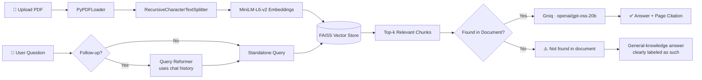

<div align="center">


<br/>

[](https://www.python.org/)
[](https://streamlit.io/)
[](https://www.langchain.com/)
[](https://github.com/facebookresearch/faiss)
[](https://groq.com/)
[](Dockerfile)

[](https://github.com/Shambhuraje1919/pdf-rag-chatbot/stargazers)
[](https://github.com/Shambhuraje1919/pdf-rag-chatbot/network/members)
[](https://github.com/Shambhuraje1919/pdf-rag-chatbot/commits/main)

**Answers stay grounded in the source PDF, with page-level citations — and a clearly labeled general-knowledge fallback when the answer isn't in the document.**

[Live Demo](https://pdf-rag-chatbot-shambhuraje.streamlit.app/#pdf-reader-chat-bot) · [Report Bug](https://github.com/Shambhuraje1919/pdf-rag-chatbot/issues) · [Request Feature](https://github.com/Shambhuraje1919/pdf-rag-chatbot/issues)

</div>

<br/>

## 📖 About

**PDF RAG Chatbot** is a multi-document Retrieval-Augmented Generation application that lets you upload one or more PDFs and have a natural, cited conversation with their contents. It combines a `LangChain` retrieval pipeline, `FAISS` vector search, and Groq's blazing-fast `openai/gpt-oss-20b` inference behind a clean `Streamlit` interface.

Every answer comes with a **page-accurate citation**, and follow-up questions are automatically reformulated into standalone queries so the retriever never loses context mid-conversation.

<br/>

## ✨ Features

| | |
|---|---|
| 📚 **Multi-Document Ingestion** | Upload and query across multiple PDFs in a single session |
| 🔍 **Semantic Search** | `all-MiniLM-L6-v2` embeddings + FAISS for fast, relevant chunk retrieval |
| 💬 **Conversational Memory** | A query-reformer rewrites follow-up questions into standalone queries using chat history |
| 📌 **Accurate Citations** | Fixed 0-index/1-index page bug — citations point to the *exact* source page |
| 🚫 **Honest Abstention + Fallback** | States clearly when an answer isn't in the document, then offers a clearly-labeled general-knowledge answer instead of leaving you stuck |
| ⚡ **Fast Inference** | Powered by Groq's `openai/gpt-oss-20b` for near-instant responses |
| 🐳 **Docker Ready** | Includes a `Dockerfile` for containerized deployment |

<br/>

## 🏗️ How It Works



<br/>

## 🧪 Accuracy Testing

Retrieval and citation accuracy weren't just assumed — they were measured. A 10-page synthetic policy document was used as a controlled test corpus, and 16 questions spanning three categories were run against the deployed app.

<div align="center">

| Category | Description | Result |
|---|---|---|
| Single-chunk | Answer lives in one section | ✅ Pass |
| Multi-hop | Answer spans two sections | ✅ Pass |
| Abstention | Answer deliberately absent from doc | ✅ Correctly flagged as not found |

### **16 / 16 correct answers · 16 / 16 correct citations · 100% accuracy**

</div>

A real bug was caught in the process: page numbers from `PyPDFLoader` are 0-indexed and section names weren't stored in metadata, so citations were silently falling back to LLM guesses. This was fixed by 1-indexing pages and extracting real section headings into the chunk metadata — all results above reflect the app *after* the fix.

<br/>

## 🛠️ Tech Stack

<div align="center">


</div>

<br/>

## 🚀 Getting Started

Just want to try it out? Skip all of this and use the **[Live Demo](https://pdf-rag-chatbot-shambhuraje.streamlit.app/#pdf-reader-chat-bot)** — no setup or API key needed.

### Prerequisites
- Python 3.10+

### Installation

```bash
# 1. Clone the repo
git clone https://github.com/Shambhuraje1919/pdf-rag-chatbot.git
cd pdf-rag-chatbot

# 2. Install dependencies
pip install -r requirements.txt

# 3. Run the app
streamlit run app.py
```

Then open **http://localhost:8501** and start uploading PDFs.

<br/>

## 📂 Project Structure

```
pdf-rag-chatbot/
├── app.py                  # Streamlit UI & chat orchestration
├── rag.py                  # RAG pipeline: loading, chunking, embedding, retrieval
├── testing/                 # RAG accuracy testing suite (16-question eval)
│   ├── TechNova_Employee_Handbook.pdf
│   ├── personalized_results.csv
│   └── RAG_Accuracy_Report.pdf
├── requirements.txt
├── Dockerfile
└── .devcontainer/
```

<br/>

## 🗺️ Roadmap

- [ ] Support for DOCX / TXT ingestion
- [ ] Persistent vector store across sessions
- [ ] Streaming token-by-token responses
- [ ] Multi-user / multi-session isolation

Contributions and suggestions are welcome — open an [issue](https://github.com/Shambhuraje1919/pdf-rag-chatbot/issues) or a PR!

<br/>

## 👤 Author

**Shambhuraje Jagadale**
B.Tech (E&TC) · Ex LLM Post-Training Intern @ Ethara AI · Kaggle Expert

[](https://github.com/Shambhuraje1919)
[](mailto:shambhurajejagadale@gmail.com)

<br/>

<div align="center">

⭐ **If this project helped you, consider giving it a star!** ⭐

</div>
